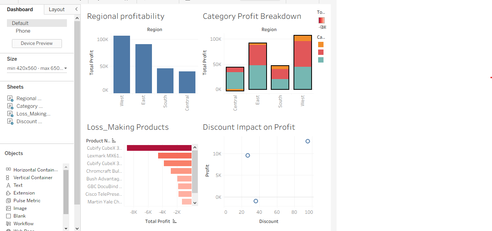

# Sales_Profitability_Analysis
End-to-end retail sales and profitability analysis using Excel, SQL(MySQL), and Tableau.

  # Overview
This project analyzes retail sales data to evaluate regional performance, category profitability, product-level losses, and the impact of discounting on profit.
The goal is to identify key drivers of profitability and inefficiencies within the business.

  # Tools Used
    > SQL (MySQL)
    > Tableau Public
    > Excel

  # Key Business Questions
    > Which regions generate the highest profit?
    > Which categories contribute most to profitability?
    > Are there persistent loss-making products?
    > How does discounting affect profit?
    > What drives underperformance in certain regions?

  # Key Insights
    > West and East regions generated the highest profit.
    > Central region showed the weakest profitability.
    > Furniture in the Central region recorded negative profit.
    > Higher discount levels were associated with lower profit.
    > A small set of products consistently generated losses.

  # Key Takeaway
  Profitability is not driven by sales volume alone, but by pricing efficiency, discount strategy, and product mix

Markdown
## Dashboard Preview

